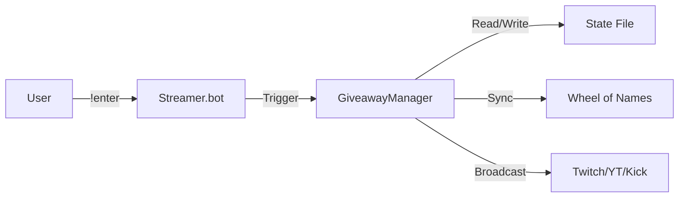

# Giveaway Bot

> **Giveaway System for Streamer.bot**
>
> 
> 
> 
> 

## 📖 Documentation

- **[User Guide](docs/USER_GUIDE.md)**: Installation, commands, and configuration.
- **[Advanced Guide](docs/ADVANCED.md)**: Custom triggers, OBS integration, and power-user features.
- **[FAQ](docs/FAQ.md)**: Troubleshooting and common questions.
- **[Developer Guide](docs/DEVELOPMENT.md)**: Architecture, contributing, and building.

## ✨ Key Features

- **Multi-Profile Support**: Run "Daily", "Weekly", and "Sub-Only" giveaways simultaneously.
- **Enterprise Security**: AES-256-CBC (DPAPI) encryption for API keys & anti-loop protection.
- **Smart Validation**: Blocks bots using entropy checks and account age verification.
- **Rich Feedback**: Windows **Toast Notifications** and highly visible chat alerts.
- **Observability**: Real-time **OBS variables** and automated wheel spins.
- **Wheel of Names Integration**: Seamlessly sync entries to the wheel and trigger spins.

## 🚀 Quick Start

1. **Download** the latest `GiveawayBot.cs` from [Releases](https://github.com/Sythsaz/Giveaway-Bot/releases).
2. **Import** into Streamer.bot:
   - Create a new Action named "Giveaway Bot".
   - Add a "Code > Execute C# Code" sub-action.
   - Paste the contents of `GiveawayBot.cs`.
   - Click "Compile" (Ensure you have references added: `System.Net.Http.dll`, `System.Core.dll`).
3. **Configure**:
   - The bot will generate a config file at `.../Streamer.bot/data/Giveaway Helper/config/giveaway_config.json`.
   - Edit this file or use the [Example Configs](examples/).
4. **Run**:
   - Type `!giveaway system test` in chat to verify installation.

## ⚙️ Core Commands

| Command  | Permission | Description                            |
| :------- | :--------- | :------------------------------------- |
| `!enter` | Everyone   | Enter the active giveaway              |
| `!start` | Mod+       | Open giveaway for entries              |
| `!end`   | Mod+       | Close giveaway                         |
| `!draw`  | Mod+       | Pick a winner (spins wheel if enabled) |

See [User Guide](docs/USER_GUIDE.md) for the full command list.

## 🏗️ Architecture

The bot uses a singleton manager pattern to handle state, configuration, and Streamer.bot interactions.

See [Architecture Docs](docs/ARCHITECTURE.md) for details.

## 🤝 Contributing

Contributions are welcome! Please read our [Contributing Guide](CONTRIBUTING.md) and
[Code of Conduct](CODE_OF_CONDUCT.md).

## 🔒 Security

We take security seriously. See our [Security Policy](SECURITY.md) for details on supported versions and reporting vulnerabilities.

---

**Maintained by [Sythsaz](https://github.com/Sythsaz)**
