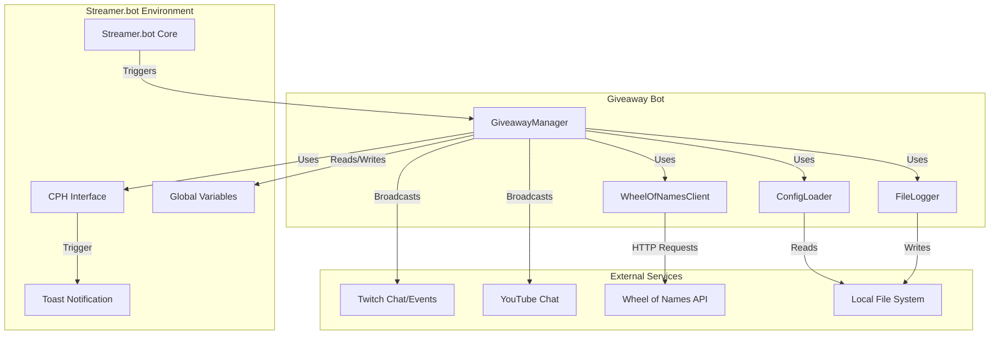

# System Architecture

## Overview

The Giveaway Bot is a single-file C# script designed to run within the **Streamer.bot** environment. It leverages
Streamer.bot's `CPH` (Channel Points Handler) interface to interact with Twitch, YouTube, and Kick, while managing
giveaway state locally.

## Core Components

### 1. GiveawayManager

The heart of the system. A singleton class that manages:

- **State**: Tracks active giveaway profile, entries, and winners.
- **Orchestration**: Routes commands (`!enter`, `!draw`) to appropriate handlers.
- **Persistence**: Syncs state to disk (`giveaway_state.json`) and Streamer.bot global variables.

### 2. ConfigLoader

Responsible for generic configuration management.

- **JSON Parsing**: Loads `giveaway_config.json`.
- **Validation**: Enforces rules (e.g., username patterns, min account age).
- **Encryption**: Handles DPAPI encryption for sensitive fields like API keys.

### 3. CPHAdapter

An abstraction layer over Streamer.bot's `CPH` object.

- **Purpose**: Decouples the bot logic from the specific Streamer.bot implementation, facilitating testing.
- **Function**: Handles sending messages, getting/setting globals, and logging.

### 4. WheelOfNamesClient

Handles integration with the Wheel of Names API v2.

- **Function**: Pushes entries to the wheel and triggers spins.
- **Features**: Supports different share modes (private, gallery) and configuration.

### 5. FileLogger

Custom logging implementation.

- **Features**: Log rotation, size capping, and structured logging to the local file system.

## Data Flow

### Entry Process

1. **User types `!enter`** in chat.
2. **Streamer.bot** detects command -> triggers `GiveawayBot.cs`.
3. **GiveawayManager** receives trigger.
4. **Validation**:
   - Is giveaway open?
   - Is user rate-limited?
   - Does username match pattern?
   - Is account old enough?
   - Is it a bot (entropy check)?
5. **Success**:
   - Add to internal list.
   - Sync to persistence (File/GlobalVar).
   - Send confirmation message (if enabled).

### Winner Selection

1. **Mod types `!draw`**.
2. **GiveawayManager** selects random winner from eligible entries.
3. **Wheel Enabled?**:
   - **Yes**: Send entries to Wheel of Names API -> Wait for spin -> Announcement.
   - **No**: Immediate announcement.
4. **Announcement**:
   - Chat message.
   - Toast notification (if enabled).
   - OBS variable update (`%GiveawayBot_Main_WinnerName%`).

## Persistence Model

The bot supports multiple persistence modes defined in `state_persistence_mode`:

- **File**: State is stored in `Giveaway Helper/state/giveaway_state.json`. Best for reliability.
- **GlobalVar**: State is stored in Streamer.bot global variable. Best for performance/ephemeral state.
- **Both**: Redundant storage for maximum safety.

## Extensibility

The bot is designed to be modified. Key extension points:

- **IGiveawayCPH**: Implement this interface to mock the bot for testing or port to other platforms.
- **GiveawayProfileConfig**: Add new properties here to support per-profile settings.
- **GiveawayManager.ProcessTrigger**: Add new command handlers or event listeners here.
